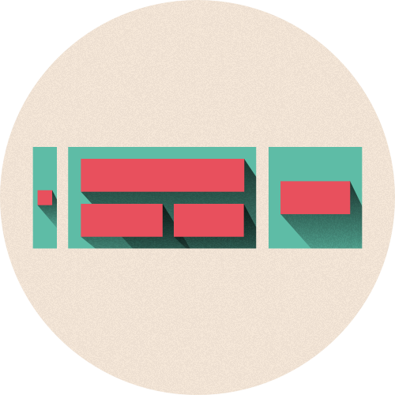

# Responsive tables
An easy, quick and robust way to implement complex tables with data and actions. Especially useful for web applications with tons of data.

# Introduction
[Stimuliz](http://stimuliz.nl) is a web application which processes a lot of data and uses lists to navigate trough data entries. These lists can contain a lot of different variables and actions and need to be clear and useful on all types of devices. That's why we set out to create robust, flexible and customizable data lists that can contain a couple of variables, labels, actions and buttons, and are clear and easy to use on mobile devices.

# Usage
__There are 2 ways to implement this table:__

### 1. Good old CSS
Simply include the responsive tables stylesheet in the `<head>` of your HTML file.

`<link href="folder/responsive-tables.min.css" rel="stylesheet">`

### 2. SCSS
Copy the file `_responsive_tables.scss` in the folder "source" and place it in your own sass structure. Import it then in your main sass file using:

`@import "responsive_tables";`

# Support
This software has been tested on all modern browsers. Including mobile browsers.

# License
Housekeeping is licensed under the MIT License, please see the LICENSE file.

# Acknowledgement
This software is based on the [stackedTable](https://github.com/ralphja16/stackedTable) software from user [ralphja16](https://github.com/ralphja16), as built for Stimuliz.